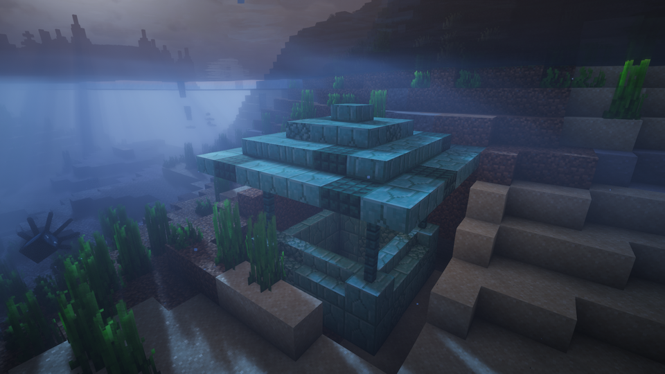

# Weathered Wells

**Water-themed exploration mod for Minecraft**

A multi-loader Minecraft mod that adds weathered wells scattered across the world, each hiding a unique totem that grants permanent water-healing abilities.



## Features

### Totems
Discover three unique totems hidden in ancient wells:
- **Soaked Totem** - A waterlogged artifact
- **Clear Totem** - A crystal-clear relic
- **Deep Totem** - An artifact from the depths

### Structures
Wells generate naturally throughout the world. Each well has an above-ground section connected to an underground chamber containing a chest with one random totem.

### Advancements
- **Water Seeps In** - Obtain a Soaked Totem
- **Clarity Settles** - Obtain a Clear Totem
- **Depths Endured** - Obtain a Deep Totem
- **At Home in Water** - Collect all three totems
- **Wells Explored** - Visit all five well structures

### Buff System
Collecting totems grants permanent buffs that persist through death:

**Blessing of the Waterways: Lingering** (Levels I-III)
- Heals when standing in water after a delay
- Higher levels reduce the healing interval (3s → 2.5s → 2s)

**Blessing of the Waterways: Attunement**
- Granted upon collecting all three totems
- Reduces activation delay from 5 seconds to 2 seconds

**Blessing of the Waterways: Immersion**
- Granted upon discovering all five well types
- Water breathing, faster underwater movement and mining

## Requirements

### For Players
- **Minecraft**: Java Edition 1.20.1, 1.21.1, 1.21.3–1.21.11
- **Mod Loader**:
  - **Fabric**: Fabric Loader with Fabric API
  - **NeoForge**: NeoForge (1.21.1+)
  - **Forge**: Forge (1.20.1 only)
### For Developers
- **Java Development Kit (JDK)**: 21 or higher
- **IDE**: IntelliJ IDEA (recommended) or Eclipse
- **Git**: For version control

## Building from Source

### Clone Repository

```bash
git clone https://github.com/ksoichiro/WeatheredWells.git
cd WeatheredWells
```

### Build Commands

```bash
# Build for default version (1.21.11) - both platforms
./gradlew build

# Build for a specific version
./gradlew build -Ptarget_mc_version=1.21.1
./gradlew build -Ptarget_mc_version=1.20.1
```

## Development Setup

### Import Project to IDE

#### IntelliJ IDEA (Recommended)
1. Open IntelliJ IDEA
2. File → Open → Select `build.gradle` in project root
3. Choose "Open as Project"
4. Wait for Gradle sync to complete

### Run in Development Environment

```bash
# Fabric Development Client (default version)
./gradlew fabric:runClient

# NeoForge Development Client (default version)
./gradlew neoforge:runClient

# Specific version
./gradlew fabric:runClient -Ptarget_mc_version=1.21.1
```

### Verify Setup

Launch the development client and verify:
- [ ] Minecraft starts successfully
- [ ] "Weathered Wells" appears in mod list
- [ ] Creative inventory includes Weathered Wells items

## Installing Pre-built JAR

1. Install the desired Minecraft version
2. Install the corresponding mod loader (Fabric + Fabric API, NeoForge, or Forge)
3. Copy the appropriate `.jar` file to the `.minecraft/mods/` folder
4. Launch Minecraft with the mod loader profile

## Project Structure

```
WeatheredWells/
├── common/
│   ├── shared/                 # Shared version-agnostic sources
│   │   └── src/main/java/com/weatheredwells/
│   │       ├── WeatheredWells.java # Common entry point
│   │       └── registry/           # Registry classes
│   └── {version}/              # Version-specific common code
│       ├── src/main/java/com/weatheredwells/
│       │   ├── effects/            # Custom mob effects
│       │   ├── events/             # Event handlers
│       │   ├── data/               # Player data
│       │   ├── mixin/              # Mixin implementations
│       │   └── worldgen/           # World generation processors
│       └── src/main/resources/
│           ├── data/weatheredwells/  # Data packs
│           └── assets/weatheredwells/ # Assets
├── fabric/
│   ├── base/                   # Shared Fabric sources
│   └── {version}/              # Fabric version subprojects
├── neoforge/
│   ├── base/                   # Shared NeoForge sources
│   └── {version}/              # NeoForge version subprojects (1.21.1+)
├── forge/
│   ├── base/                   # Shared Forge sources
│   └── {version}/              # Forge version subprojects (1.20.1)
├── props/                      # Version-specific properties
├── docs/                       # Documentation
├── build.gradle                # Root build configuration
├── settings.gradle             # Multi-module settings
└── gradle.properties           # Version configuration
```

## Resources

### Official Documentation
- [Fabric Documentation](https://docs.fabricmc.net/)
- [NeoForge Documentation](https://docs.neoforged.net/)
- [Minecraft Wiki](https://minecraft.wiki)

### Community
- [Fabric Discord](https://discord.gg/v6v4pMv)
- [NeoForge Discord](https://discord.neoforged.net/)
## License

This project is licensed under the **GNU Lesser General Public License v3.0 (LGPL-3.0)**.

Copyright (C) 2026 Soichiro Kashima

See the [COPYING](COPYING) and [COPYING.LESSER](COPYING.LESSER) files for full license text.

## Credits

- Built with [Architectury Loom](https://github.com/architectury/architectury-loom)

## Support

For issues, feature requests, or questions:
- Open an issue on [GitHub Issues](https://github.com/ksoichiro/WeatheredWells/issues)

---

**Developed for Minecraft Java Edition 1.20.1, 1.21.1, 1.21.3–1.21.11**
